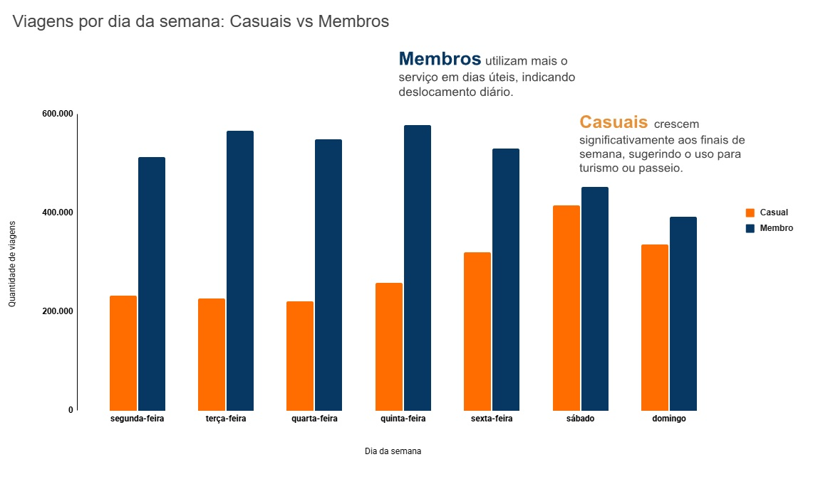
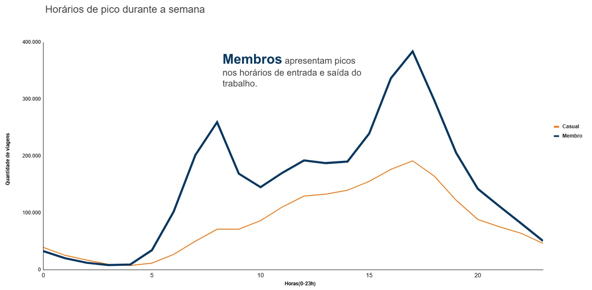
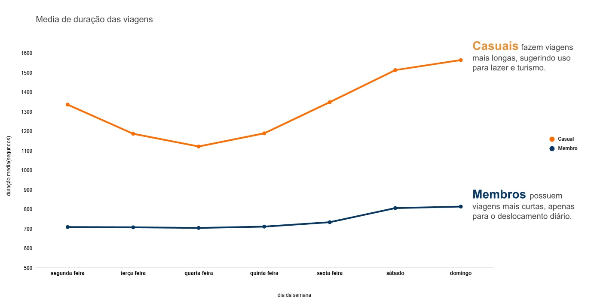
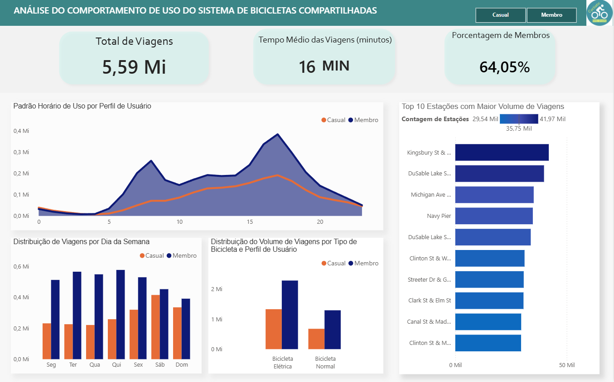

# Cyclistic Bike Share

## Introdução
Este projeto analisa dados de uma empresa fictícia de aluguel de bicicletas para identificar diferenças de comportamento entre usuários casuais e membros. A análise utiliza dados públicos do **Divvy Trip Data** e foi desenvolvida como parte do estudo de caso do **Google Data Analytics**.
Utilizando técnicas de limpeza, análise exploratória e visualização de dados, o projeto busca gerar insights que apoiem decisões estratégicas voltadas à conversão de usuários casuais em membros recorrentes.

## Objetivo do projeto
Nosso objetivo é responder à seguinte pergunta de negócio:   
**Quais são as principais diferenças de comportamento entre usuários casuais e membros do Cyclistic?** A partir dessas características, foram gerados os insights para ajudar nas decisões das equipes de marketing e produto.

## Limpeza e tratamento de dados
As principais etapas de limpeza e tratamento dos dados foram:
1.  Padronização de Tipos:
   - Conversão das colunas de data/hora (`started_at` e `ended_at`) de *string* para o formato *datetime*.
2.  Criação de Variáveis:   
- `ride_length`: Cálculo da duração da viagem em minutos (`ended_at` - `started_at`).
- `day_of_week`: Extração do dia da semana para identificar padrões.
- `month` e `hour`: Extração do mês e da hora de início para análises de sazonalidade e horários de pico.
3.  Remoção de Outliers e Inconsistências:   
- Exclusão de viagens com duração negativa ou inferior a 60 segundos.
- Exclusão de viagens com duração superior a 24 horas.
4. Filtragem de Dados de Manutenção:
- Remoção de registros com o nome da estação "HQ QR", que eram dados de testes técnicos da empresa.

## Principais insights
Após a análise exploratória dos dados, foram identificados os seguintes padrões de comportamento entre usuários casuais e membros:
1. Uso durante os dias da semana   
O gráfico mostra que membros utilizam o serviço principalmente em dias úteis, demonstrando um uso recorrente ligado ao deslocamento diário.   
Usuários casuais concentram mais suas viagens nos finais de semana, indicando uso voltado para o lazer ou turismo.

  

2. Horários de pico   
Entre os membros, observa-se dois picos de uso: no início da manhã e no fim da tarde.   
Esses são horários comuns de entrada e saída do trabalho, reforçando a ideia do uso cotidiano dos membros.

  

3. Tempo de duração das viagens   
Usuários casuais possuem viagens mais longas, especialmente aos finais de semana, indicando o uso recreativo.   
Já os membros tendem a fazer viagens mais curtas e frequentes, consistentes com o deslocamento rápido do dia a dia.

  

## Recomendações
Com base nos padrões identificados, são recomendadas as ações:   
1. Retenção de usuários casuais para membros
  - Passes de fim de semana: Criação de um plano mensal/anual exclusivo para fins de semana, com descontos ou benefícios, incentivando-os a se tornarem membros recorrentes.
  - Programas de fidelidade: Sistema de pontos baseado em distância ou duração da viagem, podendo trocar por descontos na assinatura de um plano.
2. Melhorias na distribuição nos horários de pico
  - Gestão de frotas: Garantir a disponibilidade de bicicletas em áreas residenciais entre 07-09h e centros comerciais e escritórios entre as 16-18h, para atender os horários de pico dos membros.
  - Estações: Instalar novas estações próximas a áreas de lazer, parques ou pontos turísticos, onde o público casual possui maior retenção das bicicletas.
3. Comunicação e marketing personalizados por padrão de uso
- Campanhas direcionadas a usuários casuais ativos aos fins de semana, destacando benefícios dos planos mensais e anuais após períodos de maior uso.
- Comunicação focada em economia para usuários frequentes, focando nas vantagens do plano de membros para deslocamento recorrente.

## Tecnologias utilizadas
- Python   
&emsp; - Pandas   
&emsp; - Matplotlib   
&emsp; - Seaborn   
- Excel   
&emsp; - Tabelas dinâmicas   
&emsp; - Gráficos
- Power BI

## Dashboard
Foi criado um dashboard utilizando o Power BI, permitindo a visualização dinâmica dos dados e insights. Ele inclui gráficos de barras, linhas e KPIs para destacar os padrões de uso entre membros e usuários casuais, facilitando a compreensão e a tomada de decisões estratégicas. O dashboard pode ser acessado pelo arquivo `Dashboard_Bike_Share.pbix` presente na pasta do projeto.
